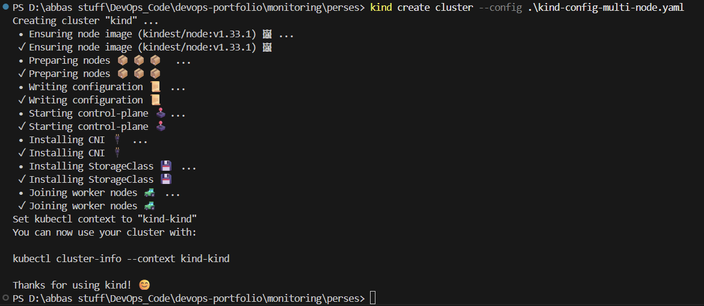

# Perses Demo – Dashboards as Code on Kubernetes

This repository demonstrates how to run [Perses](https://perses.dev/), a CNCF sandbox project, as an alternative to Grafana for Kubernetes-native dashboards.  
We’ll use a simple Go application that exposes Prometheus metrics, deploy it on a Kind cluster, install the kube-prometheus-stack, and then configure Perses dashboards as code.

---

## 🚀 Prerequisites

- [Docker](https://docs.docker.com/get-docker/)
- [Kind](https://kind.sigs.k8s.io/) (v1.33.1)
- [Kubectl](https://kubernetes.io/docs/tasks/tools/)
- [Helm](https://helm.sh/docs/intro/install/)
- Go ≥ 1.24
- [perses-cli](https://github.com/perses/perses/releases)

---

## 1️⃣ Create a Kind Cluster

```bash
kind create cluster --image kindest/node:v1.33.1 --name perses-demo
kubectl cluster-info --context kind-perses-demo
```




---


**Verify nodes:**
```bash
kubectl get nodes
```


## 📡 Step 2: Install kube-prometheus-stack

**Add the Helm repo and install:**
```bash
helm repo add prometheus-community https://prometheus-community.github.io/helm-charts
helm repo update

kubectl create ns kube-prometheus-stack

helm install kube-prometheus-stack prometheus-community/kube-prometheus-stack -n kube-prometheus-stack
```


**Check pods:**
```bash
kubectl get pods -n kube-prometheus-stack
```

## 📝 Step 3: Sample Go Application
```bash
The demo Go app exposes four Prometheus metrics:

http_requests_total → Counter for total requests by path, method, status.

http_request_duration_seconds → Histogram for request latency (p95, buckets).

in_flight_requests → Gauge tracking concurrent in-progress requests.

items_processed_total → Business metric counter with result labels (ok, error).

Key Endpoints

/work → Simulates workload (random delay, 10% error rate).

/metrics → Prometheus scrape endpoint.

/healthz → Health check for probes.

How it works

Each request increments counters, records latency in histograms, and updates gauges.

Errors/success responses are labeled in metrics.

Metrics are scraped by Prometheus Operator using a ServiceMonitor.
```
## 🐳 Step 4: Build & Deploy Go App

***Build Docker Image***
```bash
docker build -t abbasbatman/perses-demo .
```


***Load Image into Kind**
```bash
kind load docker-image demo-app:latest --name perses-demo

Deploy App + ServiceMonitor
kubectl apply -f deploy.yaml
```

***This creates:***

Namespace

Deployment + Service

ServiceMonitor (so Prometheus can scrape metrics)

## 📊 Step 5: Deploy Perses

**Create a namespace and deploy Perses:**
```bash
kubectl create ns perses
kubectl apply -f perses-deploy.yaml
```


**Check Perses:**
```bash
kubectl get pods -n perses
```

Port-forward to access the UI:
```bash
kubectl port-forward svc/perses 8081:8081 -n perses
```

Visit http://localhost:8081
.

## 🛠️ Step 6: Dashboard-as-Code with Go SDK

Perses supports Dashboard-as-Code (DaC).

Example dashboard.go

The Go SDK allows defining dashboards programmatically:

Define variables (e.g., select pods).

Define panels (PromQL queries for traffic, latency, errors).

Attach to Prometheus datasource (kube-prometheus-stack).

**Build Dashboard JSON**
```bash
percli login --url http://localhost:8081
```


```bash
percli dac build dashboard.go -o dashboard.json
```
**Apply Dashboard**

```bash
percli apply -f dashboard.json
```


Now refresh Perses UI → your dashboard should appear 🎉

## 🔥 Step 7: Generate Load

***Port-forward the app:***
```bash
kubectl port-forward svc/demo-app 8081:8080 -n demo
```

***Run load script:**
```bash
./load.sh
```

This sends repeated requests to /work, generating traffic and errors that appear in the dashboard.

## ✅ Observing Metrics

***Check Prometheus:**
```bash
kubectl port-forward svc/kube-prometheus-stack-prometheus 9090:9090 -n kube-prometheus-stack
```
```bash
Visit http://localhost:9090
```

***Check Perses Dashboards:***
```bash
http://localhost:8080
```
## 📖 Why Perses?

Open specification for dashboards

CNCF Sandbox project

Dashboard-as-Code → treat dashboards like application code

GitOps-friendly → CRDs for dashboards, datasources, projects

Developer-first workflow (Go SDK, QLang, JSON/YAML)
---
## 🏁 Closing Notes

This demo showed:

Running Prometheus + Perses on Kind

Deploying a Go app with Prometheus metrics

Creating dashboards via Go SDK + percli

Generating load and visualizing real-time metrics

Perses is still evolving (fewer datasources than Grafana), but it’s a promising CNCF-native tool for declarative, version-controlled dashboards.